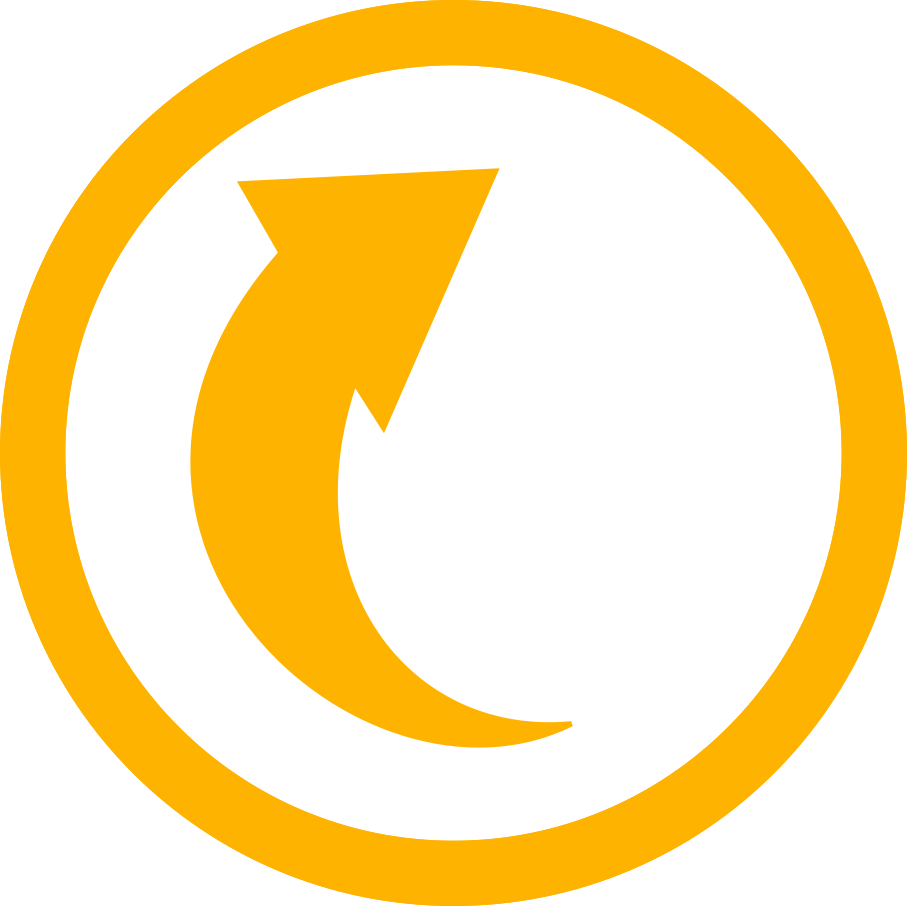
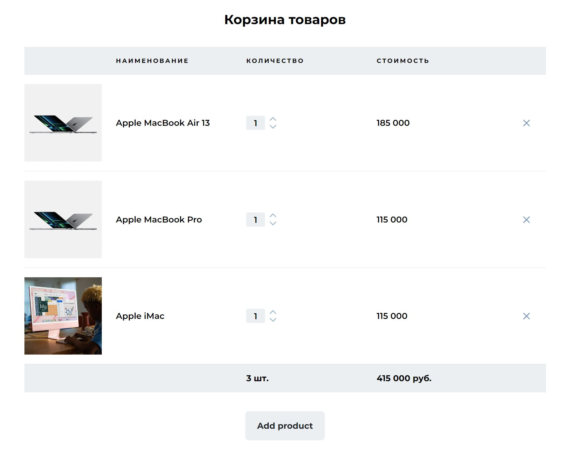
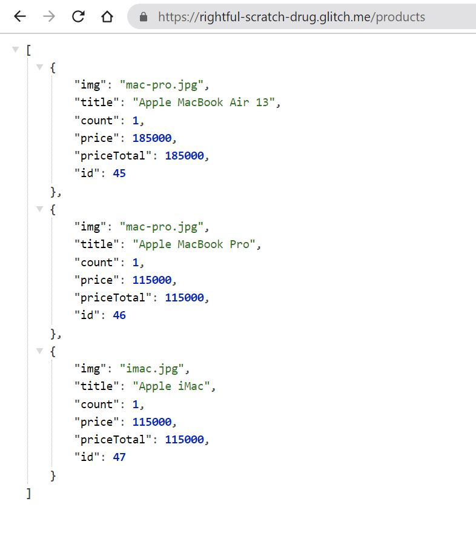

# cart-build

<!-- PROJECT LOGO -->
 

  
  

  <h3 align="center">Products Cart React App with json API </h3>

  
 Products cart application are connected to JSON server that located on Glitch.
     
     
  

<h2 align="center"><a href="https://ruslankharisov.github.io/cart-build/">Page view </a</h2>

<h2 align="center"><a  href="https://rightful-scratch-drug.glitch.me/products">JSON API</a></h2>

https://github.com/RuslanKharisov/cart-build/blob/main/img/products/json-server-glitch.JPG

 

  
    
  
    
  
  

## Contact

Ruslan Kharisov - ruslan.kharisov@gmail.com

Project Link: [https://github.com/RuslanKharisov/cart-build](https://github.com/RuslanKharisov/cart-build)
  

(<a href="#readme-top">back to top</a>)

